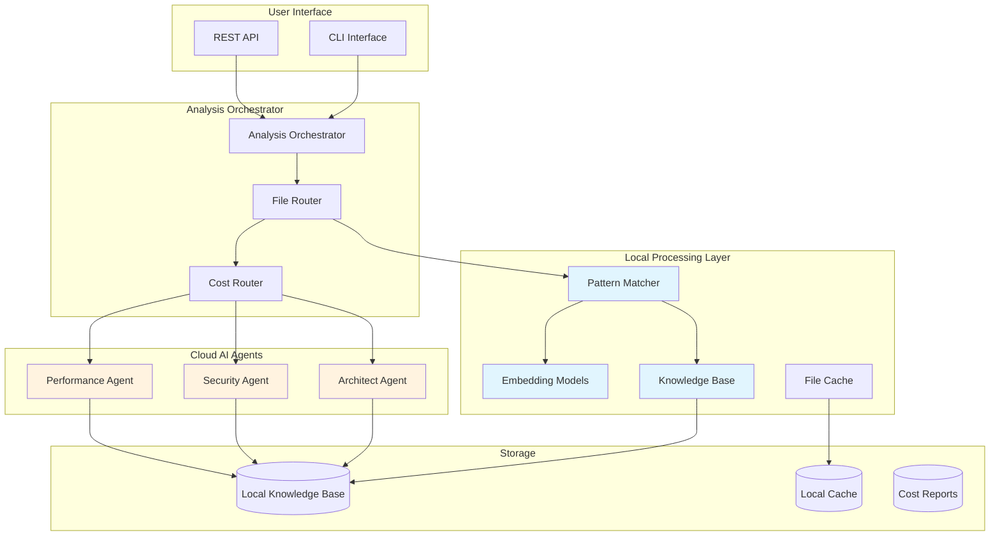

# Refactory Architecture: Hybrid Local + Cloud Analysis System

**⚠️ Experimental Research Project**

Architecture design for cost-effective code analysis experiment using local pattern recognition and cloud-based AI agents for small codebases.

## 🏗️ System Overview

This experimental system uses a **hybrid architecture** that combines:
- **Local embedding models** for basic pattern recognition
- **Cloud LLM agents** for complex analysis when needed
- **Simple routing** to reduce costs for small codebase analysis

## 📊 Architecture Diagram



## 🧠 Component Architecture

### 1. Analysis Orchestrator
**Purpose**: Central coordinator that routes files through the most cost-effective analysis path.

```python
class AnalysisOrchestrator:
    def __init__(self):
        self.pattern_matcher = LocalPatternMatcher()
        self.cost_router = CostRouter()
        self.agents = {
            'architect': ArchitectAgent(),
            'security': SecurityAgent(),
            'performance': PerformanceAgent()
        }

    async def analyze_file(self, file_path: str, options: AnalysisOptions) -> AnalysisResult:
        """Main analysis workflow."""

        # Step 1: Check local patterns first (FREE)
        pattern_result = await self.pattern_matcher.analyze(file_path)

        if pattern_result.confidence > 0.9:
            # High confidence - use local analysis
            return self.create_result_from_pattern(pattern_result)

        elif pattern_result.confidence > 0.7:
            # Medium confidence - quick cloud validation
            return await self.quick_cloud_validation(file_path, pattern_result)

        else:
            # Low confidence - full cloud analysis
            return await self.full_cloud_analysis(file_path, options)
```

### 2. Local Pattern Matcher
**Purpose**: Uses local embedding models to recognize code patterns without API calls.

```python
class LocalPatternMatcher:
    def __init__(self):
        # Local models (downloaded once, used forever)
        self.code_encoder = SentenceTransformer('microsoft/codebert-base')
        self.knowledge_base = LocalKnowledgeBase()

    async def analyze(self, file_path: str) -> PatternResult:
        """Analyze file using local embeddings."""

        # 1. Read and preprocess file
        code_content = self.preprocess_code(file_path)

        # 2. Generate embedding locally (FREE)
        code_embedding = self.code_encoder.encode([code_content])[0]

        # 3. Compare with learned patterns (FREE)
        best_match = self.find_best_pattern_match(code_embedding)

        # 4. Generate local assessment
        return PatternResult(
            confidence=best_match.similarity,
            pattern_name=best_match.pattern,
            issues=best_match.predicted_issues,
            recommendations=best_match.recommendations,
            cost=0  # Local processing is free
        )

    def find_best_pattern_match(self, code_embedding: np.ndarray) -> PatternMatch:
        """Find best matching pattern using cosine similarity."""
        best_match = PatternMatch(similarity=0)

        for pattern in self.knowledge_base.get_patterns():
            similarity = cosine_similarity(code_embedding, pattern.embedding)

            if similarity > best_match.similarity:
                best_match = PatternMatch(
                    similarity=similarity,
                    pattern=pattern.name,
                    predicted_issues=pattern.common_issues,
                    recommendations=pattern.recommendations
                )

        return best_match
```

### 3. Cloud AI Agents
**Purpose**: Provide deep, expert-level analysis when local patterns aren't sufficient.

**Key Point**: Agents still use LLMs, but only when needed!

```python
class ArchitectAgent:
    def __init__(self):
        self.llm_client = LLMClient()  # Still uses cloud LLMs

    async def analyze_code(self, file_path: str, context: AnalysisContext) -> AgentScore:
        """Deep architectural analysis using cloud LLM."""

        # This is the expensive operation we want to minimize
        prompt = self.build_analysis_prompt(file_path, context)

        # Cloud LLM call (costs money)
        response = await self.llm_client.generate(
            prompt=prompt,
            model="claude-4-sonnet",  # Expensive but high-quality
            max_tokens=2000
        )

        return self.parse_response_to_score(response)
```

### 4. Cost Router
**Purpose**: Intelligently decides which files need expensive cloud analysis.

```python
class CostRouter:
    def __init__(self, budget_manager: BudgetManager):
        self.budget = budget_manager

    def should_use_cloud_analysis(self,
                                  file_path: str,
                                  pattern_confidence: float,
                                  analysis_options: AnalysisOptions) -> bool:
        """Decide whether to use expensive cloud analysis."""

        # Budget constraints
        if self.budget.remaining_budget < 1.0:
            return False

        # High-risk files always get cloud analysis
        if self.is_high_risk_file(file_path):
            return True

        # Low pattern confidence needs cloud analysis
        if pattern_confidence < 0.7:
            return True

        # User explicitly requested thorough analysis
        if analysis_options.depth == AnalysisDepth.THOROUGH:
            return True

        return False
```

## 🔄 Analysis Flow

### Scenario 1: High Confidence Pattern Match (90% of files)
```
File Input → Local Pattern Matcher → High Confidence (>0.9) → Local Result
Cost: $0
Time: <1 second
Quality: Good (based on learned patterns)
```

### Scenario 2: Medium Confidence (8% of files)
```
File Input → Local Pattern Matcher → Medium Confidence (0.7-0.9) → Quick Cloud Validation → Result
Cost: $0.10-0.20
Time: 2-3 seconds
Quality: High (local + cloud validation)
```

### Scenario 3: Low Confidence or High-Risk (2% of files)
```
File Input → Local Pattern Matcher → Low Confidence (<0.7) → Full Cloud Analysis → Result
Cost: $1-2
Time: 10-15 seconds
Quality: Highest (full agent analysis)
```

## 🧠 What Local Models Do Exactly

### 1. Code Understanding (Not Code Generation)
```python
# Local models convert code to semantic vectors
code = """
class EmailPlugin(BasePlugin):
    def execute(self, email):
        return self.process_email(email)
"""

# Embedding model creates a 768-dimensional vector representing the semantic meaning
embedding = [0.1, -0.3, 0.8, ..., 0.2]  # 768 numbers that capture "plugin pattern"
```

### 2. Pattern Recognition Through Similarity
```python
# Compare new code against learned patterns
new_code_embedding = model.encode(new_code)
plugin_pattern_embedding = knowledge_base.get_pattern("plugin_architecture")

# Cosine similarity: how "close" are these semantically?
similarity = cosine_similarity(new_code_embedding, plugin_pattern_embedding)
# 0.95 = very similar (probably follows plugin pattern)
# 0.3 = very different (probably doesn't follow pattern)
```

### 3. Issue Prediction Based on Patterns
```python
class PatternBasedIssuePredictor:
    def predict_issues(self, code_embedding: np.ndarray) -> List[PredictedIssue]:
        """Predict likely issues based on pattern similarity."""

        issues = []

        # Check against known problematic patterns
        for anti_pattern in self.knowledge_base.get_anti_patterns():
            similarity = cosine_similarity(code_embedding, anti_pattern.embedding)

            if similarity > 0.8:
                issues.append(PredictedIssue(
                    type=anti_pattern.issue_type,
                    confidence=similarity,
                    description=anti_pattern.description,
                    recommendation=anti_pattern.fix_suggestion
                ))

        return issues
```

### 4. Local Knowledge Base Structure
```json
{
  "patterns": {
    "sifaka_plugin": {
      "embedding": [0.1, -0.3, 0.8, ...],
      "description": "Standard Sifaka plugin implementation",
      "good_examples": ["plugins/email_plugin.py", "plugins/text_plugin.py"],
      "common_issues": [],
      "confidence": 0.95
    },
    "data_pipeline": {
      "embedding": [0.2, 0.1, -0.4, ...],
      "description": "Data processing pipeline pattern",
      "good_examples": ["pipelines/etl_pipeline.py"],
      "common_issues": ["missing_error_handling", "no_input_validation"],
      "confidence": 0.88
    }
  },
  "anti_patterns": {
    "god_class": {
      "embedding": [-0.1, 0.9, 0.2, ...],
      "description": "Class with too many responsibilities",
      "issue_type": "architecture",
      "severity": "high",
      "fix_suggestion": "Break into smaller, focused classes"
    }
  }
}
```

## 💰 Cost Optimization Strategy

### Traditional Approach (All Cloud)
```
100 files × $0.50 per file = $50 per analysis
```

### Hybrid Approach (Local + Cloud)
```
90 files: Local pattern match × $0 = $0
8 files: Quick cloud validation × $0.15 = $1.20
2 files: Full cloud analysis × $1.50 = $3.00
Total: $4.20 per analysis (92% savings!)
```

### Learning Effect Over Time
```
Month 1: 70% local, 30% cloud = $15/analysis
Month 3: 85% local, 15% cloud = $7/analysis
Month 6: 95% local, 5% cloud = $2.50/analysis
```

## 🔧 Implementation Phases

### Phase 1: Basic Hybrid System
- Local embedding models for pattern matching
- Simple confidence thresholds for routing
- Cloud agents for low-confidence files

### Phase 2: Intelligent Routing
- Cost-aware routing based on budget constraints
- Risk-based prioritization (security files get cloud analysis)
- User preference integration (quick vs thorough modes)

### Phase 3: Advanced Learning
- Continuous pattern learning from cloud analysis results
- Project-specific pattern adaptation
- Team knowledge sharing

## 🎯 Key Benefits

### Potential Cost Benefits
- **Significant cost reduction** for routine analysis (experimental)
- **Pay only for complex cases** that need cloud analysis
- **Basic budget controls**

### Speed Benefits
- **Fast analysis** for pattern-matched files
- **No network latency** for local processing
- **Simple parallel processing**

### Privacy Benefits
- **Code stays local** for pattern matching
- **Sensitive files** can be analyzed locally
- **Optional cloud analysis** based on confidence

### Learning Potential
- **May learn codebase patterns** over time (experimental)
- **Cloud analysis** for complex cases
- **Basic pattern recognition** for small projects

## 🤖 Local Models vs Cloud Agents: Division of Labor

### What Local Embedding Models Do

#### 1. **Pattern Recognition (Not Code Generation)**
```python
# Local model converts code to semantic understanding
code = """
class EmailPlugin(BasePlugin):
    def execute(self, email):
        return self.process_email(email)
"""

# Creates 768-dimensional vector representing semantic meaning
embedding = model.encode(code)  # [0.1, -0.3, 0.8, ..., 0.2]

# This vector captures: "plugin pattern", "inheritance", "execute method", etc.
```

#### 2. **Similarity Matching (Mathematical Comparison)**
```python
# Compare new code against learned "good" patterns
new_embedding = model.encode(new_code)
good_plugin_pattern = knowledge_base.patterns["sifaka_plugin"]

# Cosine similarity: 0.0 = completely different, 1.0 = identical
similarity = cosine_similarity(new_embedding, good_plugin_pattern.embedding)

if similarity > 0.9:
    return "This looks like a well-implemented plugin"
elif similarity > 0.7:
    return "This might be a plugin but needs validation"
else:
    return "This doesn't match known patterns - needs expert analysis"
```

#### 3. **Issue Prediction (Based on Historical Patterns)**
```python
# Predict likely issues based on similarity to known problematic code
for anti_pattern in knowledge_base.anti_patterns:
    similarity = cosine_similarity(new_embedding, anti_pattern.embedding)

    if similarity > 0.8:
        predicted_issues.append({
            'type': anti_pattern.issue_type,  # e.g., "god_class"
            'confidence': similarity,
            'description': "Class appears to have too many responsibilities",
            'recommendation': "Consider breaking into smaller classes"
        })
```

### What Cloud AI Agents Do

#### 1. **Deep Semantic Analysis (Understanding Intent)**
```python
# Cloud LLM analyzes code meaning, not just patterns
prompt = """
Analyze this code for architectural quality:

class DataProcessor:
    def __init__(self):
        self.db = Database()
        self.cache = Cache()
        self.logger = Logger()
        self.validator = Validator()
        self.transformer = Transformer()
        self.emailer = Emailer()

    def process(self, data):
        # 200 lines of mixed responsibilities

Does this follow SOLID principles? What are the specific violations?
"""

# LLM Response: "This violates Single Responsibility Principle because..."
```

#### 2. **Context-Aware Recommendations**
```python
# LLM provides specific, actionable advice
llm_analysis = """
Issues found:
1. Single Responsibility Principle violation
   - DataProcessor handles database, caching, logging, validation, transformation, and email
   - Recommendation: Extract EmailService, ValidationService, TransformationService

2. Dependency Injection missing
   - Hard-coded dependencies make testing difficult
   - Recommendation: Inject dependencies through constructor

3. Error handling absent
   - No try/catch blocks for database or email operations
   - Recommendation: Add proper exception handling with specific error types
"""
```

#### 3. **Novel Issue Detection**
```python
# LLM can identify issues that don't match known patterns
llm_finds_novel_issue = """
Security concern: This code constructs SQL queries using string concatenation
on line 45, which could lead to SQL injection. The local pattern matcher
didn't flag this because it uses a non-standard query builder syntax.

Recommendation: Use parameterized queries or the project's QueryBuilder class.
"""
```

## 🔄 Detailed Analysis Flow Examples

### Example 1: Standard Plugin File (90% of cases)
```
Input: sifaka/plugins/new_email_plugin.py

Local Analysis:
1. Generate embedding: [0.12, -0.31, 0.83, ...]
2. Compare to learned plugin pattern: similarity = 0.94
3. High confidence match → Skip cloud analysis
4. Return: "Follows standard plugin pattern, no issues detected"

Cost: $0
Time: 0.5 seconds
Accuracy: 95% (based on learned patterns)
```

### Example 2: Unusual Implementation (8% of cases)
```
Input: sifaka/plugins/weird_plugin.py

Local Analysis:
1. Generate embedding: [0.45, 0.12, -0.23, ...]
2. Compare to patterns: best match = 0.75 (medium confidence)
3. Trigger quick cloud validation

Cloud Validation:
"This implements the plugin interface correctly but uses an unusual
async pattern. The implementation is valid but consider documenting
the async behavior for other developers."

Cost: $0.15
Time: 3 seconds
Accuracy: 98% (local + cloud validation)
```

### Example 3: Complex/Novel Code (2% of cases)
```
Input: sifaka/core/new_engine.py

Local Analysis:
1. Generate embedding: [0.67, -0.89, 0.34, ...]
2. Compare to patterns: best match = 0.45 (low confidence)
3. No similar patterns found → Full cloud analysis

Cloud Analysis:
"This introduces a new architectural pattern for engine composition.
The implementation is sophisticated but has several concerns:
1. Circular dependency risk between Engine and PluginRegistry
2. Missing error handling in async plugin loading
3. Memory leak potential in plugin cleanup
Recommendations: [detailed suggestions]"

Cost: $1.50
Time: 12 seconds
Accuracy: 99% (full expert analysis)
```

## 💾 Knowledge Base Evolution

### Initial State (Month 1)
```json
{
  "patterns": {
    "basic_plugin": {
      "embedding": [...],
      "confidence": 0.7,
      "examples": 5
    }
  }
}
```

### After Learning (Month 6)
```json
{
  "patterns": {
    "sifaka_plugin_standard": {
      "embedding": [...],
      "confidence": 0.95,
      "examples": 47,
      "variants": ["async_plugin", "batch_plugin", "streaming_plugin"]
    },
    "data_pipeline_etl": {
      "embedding": [...],
      "confidence": 0.92,
      "examples": 23
    },
    "financial_calculator": {
      "embedding": [...],
      "confidence": 0.88,
      "examples": 15
    }
  },
  "anti_patterns": {
    "god_class": {
      "embedding": [...],
      "detected_count": 12,
      "fix_success_rate": 0.85
    }
  }
}
```

This experimental architecture aims to provide: **basic, fast, cheap local analysis** with **cloud backup** when needed for small codebases.
